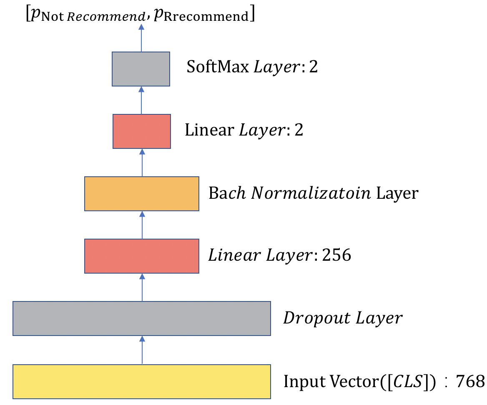
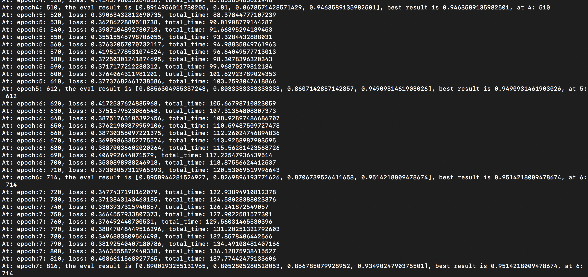

# Chinese-Text-Classification-Based-on-Bert
基于Bert实现中文文本二分类

## 1. 数据预处理

### 1.1 去噪

观察训练数据，发现训练数据中有很多重复数据，且有些重复数据的拥有多种标签：
    
对于这类example，计算所有标签的均值`$\avg$`，通过以下方法来给它重新分配标签：

```python
if avg > 0.5:
    label = 1
else:
    label = 0
```

### 1.2 数据集划分

由于没有提供验证集，所以原先的训练集中随机抽取`$5%$`的样本作为验证集：

```python
random.shuffle(results)
index = int(len(results)*ratio)
valid = results[index:]  # validation dataset
results = results[:index]  # training dataset 
```

### 1.3 添加特殊符号
由于使用的是中文版`$bert-base-chinese$`预训练的Bert模型，且该版本是基于字的，所以不需要对每个example的sentence进行分词，只需要在每个sentence的开始和结尾添分别特殊符号：`$[CLS]$`和`$[SEP]$`:

```python
sequence = ['[CLS]'] + self.sequence_list[item] + ['[SEP]']

```

### 1.4 Padding and MASK
保证batch中的example长度都相等，长度不足的在末尾补`$0$`，同时，计算mask矩阵，mask矩阵中，`$1$`表示为真是样本中的字，`$0$`表示补充部分：

```python
labels, seq_ids, lens, seqs = zip(*batch)
seq_ids = pad_sequence(seq_ids, batch_first=True, padding_value=0)
    
bsz, max_len = seq_ids.size()
masks = np.zeros([bsz, max_len], dtype=np.float)

for index, seq_len in enumerate(lens):
    masks[index][:seq_len] = 1

 masks = torch.from_numpy(masks)
```
## 2. 模型

模型采用Bert+MLP的形式，Bert使用预训练的`$bert-base-chinese$`，使用`$[CLS]$`符号对应的输出作为MLP层的输入，MLP层的结构如下：



## 3. 训练
### 3.1 优化器
采用`$Adam$`优化器，预训练的`$Bert$`模型和`$MLP$`模型采用两种不同的学习率`$2e-5和0.01$`（`$Bert$`部分只需要微调，而`$MLP$`部分需要从头开始训练）:

```python
bert_named_parameters = list(self.model.bert.named_parameters())
classifier_parameters = list(self.model.classifier.parameters())
no_decay = ['bias', 'LayerNorm.bias', 'LayerNorm.weight']

optimizer_grouped_parameters = [
    {'params': [p for n, p in bert_named_parameters if not any(nd in n for nd in no_decay)], 'weight_decay': 0.01,
     'lr': config.bert_lr},
    {'params': [p for n, p in bert_named_parameters if any(nd in n for nd in no_decay)], 'weight_decay': 0.0,
     'lr': config.bert_lr},
    {'params': classifier_parameters}]

self.optimizer = AdamW(params=optimizer_grouped_parameters, lr=config.lr)
```

每隔1个epoch在验证集上评估一次，如果相比于上次评估auc指标有所提升，则保存模型

### 3.2 结果
在第6个epoch，模型去验证集取得最好的结果：



### 4. 评估

加载保存的在验证集上效果最好的模型，在测试集上跑一遍，将结果保存在`$submission\_random.csv$`文件中，详情参考`$eval\_model.py$`


